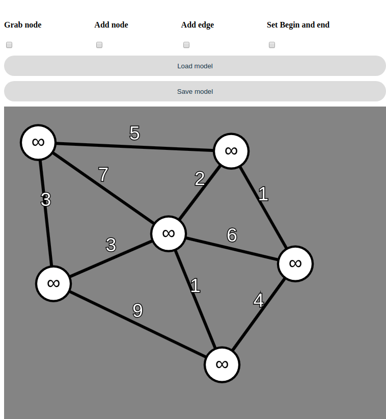

# Dijkstra-algorithm-P5.js
> A graph builder in the browser that will find the shortest path from A to B

##
> 
> 
> 

## Table of contents
* [Technologies](#technologies)
* [Setup](#setup)
* [Features](#features)
* [Status](#status)

## Screenshots

## Technologies
* Makes use of the p5.js library, the program will load it directly from cloudfare
* Makes use of localStorage in the browser to 

## Setup
To run, simply clone the repository and run the index.html, no further installation required

## Features
List of features ready and TODOs for future development
* Save and load your own graphs
* Get fastest route from every point to another

To-do list:
* Add loop functionality
* Add better route traceback
* Add graph import and export to other devices
* Add one option checker / replacer
* Add minimal-cost spanning tree finder

## Status
This project is a work in progress

Created by Raymonzut
